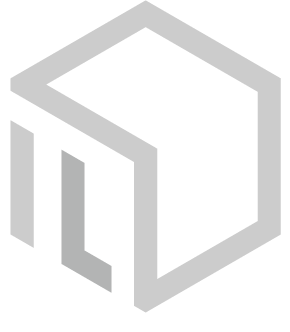
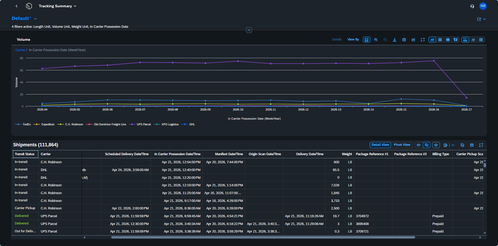

<!doctype html>
<html lang="en">
<head>
<meta charset="utf-8" />
<meta name="viewport" content="width=device-width, initial-scale=1" />
<title>Intelligent Logistics — Logistics analytics that put your shipping data to work</title>
<link rel="preconnect" href="https://fonts.googleapis.com">
<link rel="preconnect" href="https://fonts.gstatic.com" crossorigin>
<link href="https://fonts.googleapis.com/css2?family=Inter:wght@400;500;600;700&family=Instrument+Serif:ital@0;1&family=IBM+Plex+Mono:wght@400;500&family=Geist:wght@400;500;600;700&family=Fraunces:ital,wght@0,400;0,600;1,400&family=Space+Grotesk:wght@400;500;600;700&display=swap" rel="stylesheet">

</head>
<body data-theme="dark" data-density="balanced" data-hero="split" data-tone="formal">

<!-- ================= NAV ================= -->
<nav class="nav" id="nav">
  

    <a href="#" class="logo">
      
      Intelligent <em>Logistics</em>
    </a>
    

      <a href="#product">Product</a>
      <a href="#use-cases">Use cases</a>
      <a href="#about">Company</a>
      <a href="#voices">Customers</a>
      <a href="#resources">Resources</a>
      <a href="#contact">Contact</a>
    

    

      <button class="btn btn-primary" onclick="scrollToId('contact')">Book a demo <svg viewBox="0 0 20 20" fill="none"><path d="M4 10h12m0 0l-4-4m4 4l-4 4" stroke="currentColor" stroke-width="1.6" stroke-linecap="round"/></svg></button>
      <button class="mobile-toggle" onclick="toggleMobileMenu()" aria-label="Menu">
        <svg viewBox="0 0 24 24" fill="none"><path d="M4 7h16M4 12h16M4 17h16" stroke="currentColor" stroke-width="1.5" stroke-linecap="round"/></svg>
      </button>
    

  

</nav>

  <button class="close" onclick="toggleMobileMenu()"><svg width="24" height="24" viewBox="0 0 24 24" fill="none"><path d="M6 6l12 12M6 18L18 6" stroke="currentColor" stroke-width="1.5" stroke-linecap="round"/></svg></button>
  <a href="#product" onclick="toggleMobileMenu()">Product</a>
  <a href="#use-cases" onclick="toggleMobileMenu()">Use cases</a>
  <a href="#about" onclick="toggleMobileMenu()">Company</a>
  <a href="#voices" onclick="toggleMobileMenu()">Customers</a>
  <a href="#contact" onclick="toggleMobileMenu()">Contact</a>

<!-- ================= HERO ================= -->
<header class="hero">
  

    

      Logistics analytics platform
      <h1 class="hero-title" id="heroTitle"></h1>
      

      

        <button class="btn btn-accent" onclick="scrollToId('contact')">Schedule a demo <svg viewBox="0 0 20 20" fill="none"><path d="M4 10h12m0 0l-4-4m4 4l-4 4" stroke="currentColor" stroke-width="1.6" stroke-linecap="round"/></svg></button>
        <button class="btn" onclick="scrollToId('product')">Explore the product</button>
      

      

        
 Trusted by hundreds of enterprises

        
 No integration required

      

    

    

      

        
        

          

            

            
Tracking Overview

          

          

            <svg viewBox="0 0 24 24" fill="none" width="32" height="32"><path d="M12 5v14M5 12h14" stroke="currentColor" stroke-width="1.5" stroke-linecap="round"/></svg>
            
Drop product screenshot

            
PNG or JPG · click to upload

          

        

        <button class="shot-replace" onclick="event.stopPropagation(); pickShot('hero')">Replace</button>
      

      

        
        

          

            

            
Shipments · Detail view

          

          

            <svg viewBox="0 0 24 24" fill="none" width="32" height="32"><path d="M12 5v14M5 12h14" stroke="currentColor" stroke-width="1.5" stroke-linecap="round"/></svg>
            
Drop secondary screenshot

            
PNG or JPG · click to upload

          

        

        <button class="shot-replace" onclick="event.stopPropagation(); pickShot('hero2')">Replace</button>
      

    

  

</header>

<!-- ================= LOGOS ================= -->

  

Trusted by hundreds of enterprise shippers

  

<!-- ================= ABOUT ================= -->
<section class="about" id="about">
  

    

      

        About
        <h2 id="aboutTitle"></h2>
        

        

          <button class="btn" onclick="scrollToId('product')">See how it works</button>
        

      

      

        

          
<em>300+</em>

          
Enterprise customers

        

        

          
$<em>1.2B</em>

          
Analyzed shipping spend

        

        

          
<em>40+</em>carriers

          
Parcel · LTL · freight

        

        

          
<em>14</em>%

          
Avg. spend reduction

        

      

    

  

</section>

<!-- ================= FEATURES ================= -->
<section id="product">
  

    

      Product
      <h2 id="featTitle"></h2>
      

    

    

      <!-- 1: Spend breakdown — large -->
      

        
01 / Spend

        <h3>Find and <em>eliminate</em> wasteful shipping charges.</h3>
        
Address corrections, residential surcharges, additional handling — every controllable dollar, by carrier, by account, by lane.

        

          

            
Addr. correct

$184K

            
Residential

$142K

            
Add'l handling

$108K

            
Dim. weight

$81K

            
Fuel

$54K

          

        

      

      <!-- 2: Real-time tracking — small (2 col) -->
      

        
02 / Visibility

        <h3>Real-time, everywhere.</h3>
        
Live shipment events across every carrier, normalized into one feed.

        

          

            <svg viewBox="0 0 400 180" style="position:absolute;inset:0;width:100%;height:100%;opacity:.25">
              <path d="M20,120 Q80,60 140,100 T260,80 T380,110" stroke="currentColor" stroke-width="1" fill="none" stroke-dasharray="2 3"/>
              <path d="M30,80 Q100,140 180,90 T340,60" stroke="currentColor" stroke-width="1" fill="none" stroke-dasharray="2 3"/>
            </svg>
            
            
            
            
            
          

        

      

      <!-- 3: Automated reporting — half -->
      

        
03 / Reporting

        <h3>Reports that <em>schedule themselves</em>.</h3>
        
Push normalized KPIs to inbox, SFTP, or your BI stack. No spreadsheets, no stitching, no drift.

        

          Daily exceptions
          Weekly spend
          Monthly carrier scorecard
          On-time by DC
          POD retention
        

      

      <!-- 4: Carrier-agnostic — half -->
      

        
04 / Carriers

        <h3>Every carrier, one <em>normalized</em> view.</h3>
        
Parcel, LTL, and freight — UPS, FedEx, DHL, USPS, Old Dominion, and 35+ more — flow into one schema you can actually query.

        

          UPS
          FedEx
          DHL
          USPS
          Old Dominion
          Estes
          XPO
          R+L
          +32 more
        

      

      <!-- 5-7: three small tiles -->
      

        
05 / Retention

        <h3 style="font-size:22px;">Indefinite POD storage.</h3>
        
Proof of delivery and tracking history, retained forever. No more 90-day carrier black holes.

      

      

        
06 / Access

        <h3 style="font-size:22px;">Unlimited seats.</h3>
        
Role-based permissions for ops, finance, and leadership. One platform, one source of truth.

      

      

        
07 / Deploy

        <h3 style="font-size:22px;">Live in days, not quarters.</h3>
        
Cloud-native. No on-prem. No integration sprints. We read your carrier data directly.

      

    

  

</section>

<!-- ================= USE CASES ================= -->
<section class="uc" id="use-cases">
  

    

      Use Cases
      <h2>Eight ways teams <em>put their data to work</em>.</h2>
      
From wasteful-spend monitoring to proof-of-delivery retention — the workflows our customers run on IL every day.

    

    

      

        

01
<h3 class="uc-title">Wasteful <em>spend</em> monitoring</h3>
Identify unnecessary charges before they become recurring costs.

        View use case →
      

      

        

02
<h3 class="uc-title">Address <em>corrections</em></h3>
Turn address errors into actionable insights you can route back to source systems.

        View use case →
      

      

        

03
<h3 class="uc-title">Proof of delivery <em>retention</em></h3>
Access proof of delivery when you need it — not just for 120 days.

        View use case →
      

      

        

04
<h3 class="uc-title">Delayed package <em>monitoring</em></h3>
See problems before your customers do, across every carrier.

        View use case →
      

      

        

05
<h3 class="uc-title">On-time <em>performance</em> reporting</h3>
Measure what your carriers actually deliver — not what they promise.

        View use case →
      

      

        

06
<h3 class="uc-title">Exceptions <em>monitoring</em></h3>
Proactively identify and resolve shipping issues before they escalate.

        View use case →
      

      

        

07
<h3 class="uc-title">Service level &amp; <em>mode analysis</em></h3>
Ensure you’re paying for the right service — every time.

        View use case →
      

      

        

08
<h3 class="uc-title">Interactive <em>dashboards</em></h3>
A command center for your entire shipment network — built for every team.

        View use case →
      

    

  

</section>

<!-- ================= TESTIMONIALS ================= -->
<section class="testimonials" id="voices">
  

    

      Customer Stories
      <h2 id="tmTitle"></h2>
      
Real outcomes from real shipping teams.

    

    

      <article class="cs-card cs-lg reveal">
        
Wholesale RetailEnterprise visibility &amp; daily analytics

        <blockquote class="cs-quote">“I’ve been utilizing the IL platform for well over a year now… Overall, I would highly recommend this program to anyone looking into it.”</blockquote>
        

          

            

            

Traffic Manager

Big-box wholesale retail

          

          <ul class="cs-outcomes">
            <li>Daily use across teams</li>
            <li>Faster access to actionable data</li>
            <li>High adoption, minimal training</li>
          </ul>
        

      </article>

      <article class="cs-card reveal">
        
Medical DevicesFreight spend &amp; cost recovery

        <blockquote class="cs-quote">“…centralize freight data… break down charges… perform our own audits and identify billing discrepancies… recover costs… negotiate more effectively.”</blockquote>
        

          

            

            

Manager, Data Governance

Medical device manufacturer

          

        

      </article>

      <article class="cs-card reveal">
        
Financial ServicesProactive exception management

        <blockquote class="cs-quote">“IL has been extremely useful… proactive tracking… compile package level detailed billing data… outstanding customer service.”</blockquote>
        

          

            

            

Business Operations

National financial services

          

        

      </article>

      <article class="cs-card reveal">
        
Restaurant TechRapid onboarding &amp; enablement

        <blockquote class="cs-quote">“The Intelligent Logistics solution is incredibly powerful, and easy to use with outstanding help and support… fast onboarding.”</blockquote>
        

          

            

            

Supply Chain Strategy

Restaurant technology platform

          

        

      </article>

      <article class="cs-card reveal">
        
Luxury FashionCarrier performance &amp; billing

        <blockquote class="cs-quote">“…monitoring our carrier performance… billing dashboard… The Customer Success team has been extremely reliable.”</blockquote>
        

          

            

            

Coordinator, Logistics

Luxury fashion &amp; leather goods

          

        

      </article>

      <article class="cs-card cs-lg reveal">
        
Electrical DistributionFreight recovery &amp; POD retention

        <blockquote class="cs-quote">“…improving our freight recovery… the ability to query old PODs has saved us countless times.”</blockquote>
        

          

            

            

Transportation Operations

Electrical products distributor

          

          <ul class="cs-outcomes">
            <li>Improved freight recovery</li>
            <li>Faster claims resolution</li>
            <li>Reduced erroneous shipping claims</li>
          </ul>
        

      </article>
    

  

</section>

<!-- ================= RESOURCES ================= -->
<section class="resources" id="resources">
  

    

      Resources
      <h2 class="res-title">Expert support built into <em>every subscription</em>.</h2>
      
Technology is only part of the value. Every customer works with a Dedicated Customer Success Manager — a long-term partner embedded in your team.

    

    

      

        Your Dedicated CSM
        <h3 class="res-h3">A single point of contact. A long-term partner.</h3>
        
Your CSM works as an extension of your team — helping you move faster, uncover insights, and continuously improve how you manage logistics data. Most analytics platforms stop at implementation. We don't.

        

          <button class="btn btn-primary" onclick="scrollToId('contact')">Book a demo <svg viewBox="0 0 20 20" fill="none"><path d="M4 10h12m0 0l-4-4m4 4l-4 4" stroke="currentColor" stroke-width="1.5" stroke-linecap="round"/></svg></button>
          <button class="btn" onclick="scrollToId('product')">Explore the platform</button>
        

      

      

        <article class="res-card reveal">
          
01

          <h4>Onboarding &amp; tenant setup</h4>
          
Configuration, carrier onboarding, data normalization, and permissions — handled.

        </article>
        <article class="res-card reveal">
          
02

          <h4>Training &amp; enablement</h4>
          
Role-based training, best practices, and ongoing enablement across your team.

        </article>
        <article class="res-card reveal">
          
03

          <h4>Proactive support</h4>
          
Custom report building, troubleshooting, and surfacing underutilized features.

        </article>
        <article class="res-card reveal">
          
04

          <h4>Ongoing optimization</h4>
          
New carriers and locations, KPI refinement, long-term historical analysis.

        </article>
      

    

    

      
Why it matters

      <ul class="res-outcomes">
        <li>Faster time to value</li>
        <li>Higher platform adoption across teams</li>
        <li>Reduced internal support burden</li>
        <li>Continuous insight into shipping costs &amp; performance</li>
        <li>Expert support always available</li>
      </ul>
    

  

</section>

<!-- ================= CTA / CONTACT ================= -->
<section class="cta-section" id="contact">
  

    

      

        Contact IL Sales
        <h2 id="ctaTitle" style="margin-top:24px;"></h2>
        

      

      

        <form class="cta-form" id="contactForm" novalidate>
          

            

              <label for="fName">Name</label>
              <input id="fName" name="name" placeholder="Morgan Chen" required>
            

            

              <label for="fCo">Company</label>
              <input id="fCo" name="company" placeholder="Acme Distribution" required>
            

          

          

            <label for="fEmail">Work email</label>
            <input id="fEmail" name="email" type="email" placeholder="morgan@acmedist.com" required>
            

          

          

            

              <label for="fVol">Monthly shipments</label>
              <select id="fVol" name="volume">
                <option>Under 10,000</option>
                <option>10K – 100K</option>
                <option>100K – 1M</option>
                <option>1M+</option>
              </select>
            

            

              <label for="fRole">Role</label>
              <select id="fRole" name="role">
                <option>Supply chain</option>
                <option>Finance</option>
                <option>Operations</option>
                <option>Executive</option>
              </select>
            

          

          <button type="submit" class="btn btn-accent" style="margin-top:4px;align-self:flex-start;">Request a demo <svg viewBox="0 0 20 20" fill="none"><path d="M4 10h12m0 0l-4-4m4 4l-4 4" stroke="currentColor" stroke-width="1.6" stroke-linecap="round"/></svg></button>
        </form>
      

    

  

</section>

<!-- ================= FOOTER ================= -->
<footer>
  

    

      

        <a href="#" class="logo">
          
          Intelligent <em>Logistics</em>
        </a>
        
Logistics analytics that put your shipping data to work.

      

      

        <h5>Product</h5>
        <ul>
          <li><a href="#product">Platform</a></li>
          <li><a href="#product">Integrations</a></li>
          <li><a href="#use-cases">Use cases</a></li>
        </ul>
      

      

        <h5>Company</h5>
        <ul>
          <li><a href="#about">About</a></li>
          <li><a href="#voices">Customers</a></li>
          <li><a href="#contact">Contact</a></li>
        </ul>
      

      
    

    

      © 2026 Intelligent Logistics
      
    

  

</footer>

<!-- ================= USE CASE MODAL ================= -->

  

  

    

      

        
Use Cases · 

        <h3 id="ucTitle"></h3>
        

      

      <button class="modal-close" onclick="closeUC()" aria-label="Close">
        <svg width="16" height="16" viewBox="0 0 24 24" fill="none"><path d="M6 6l12 12M6 18L18 6" stroke="currentColor" stroke-width="1.8" stroke-linecap="round"/></svg>
      </button>
    

    

      

        
        

          

          

            <svg viewBox="0 0 24 24" fill="none" width="28" height="28"><path d="M12 5v14M5 12h14" stroke="currentColor" stroke-width="1.5" stroke-linecap="round"/></svg>
            
Drop IL screenshot

            
PNG or JPG · click to upload

          

        

        <button class="shot-replace" onclick="event.stopPropagation(); pickShot('uc-' + currentUC)">Replace</button>
      

    

    

    

      
      

        <button class="btn" onclick="closeUC()">Back to use cases</button>
        <button class="btn btn-accent" onclick="closeUC(); scrollToId('contact')">Schedule a demo</button>
      

    

  

<input type="file" id="fileInput" accept="image/*" style="display:none">

<!-- ================= TWEAKS ================= -->

  

    <h4>Tweaks</h4>
    <button class="close" onclick="hideTweaks()" aria-label="Close"><svg width="14" height="14" viewBox="0 0 24 24" fill="none"><path d="M6 6l12 12M6 18L18 6" stroke="currentColor" stroke-width="2" stroke-linecap="round"/></svg></button>
  

  

    

      <label>Palette</label>
      

    

    

      <label>Font pairing</label>
      

    

    

      <label>Hero layout</label>
      

    

    

      <label>Density</label>
      

    

    

      <label>Theme</label>
      

    

    

      <label>Copy tone</label>
      

    

  

</body>
</html>
